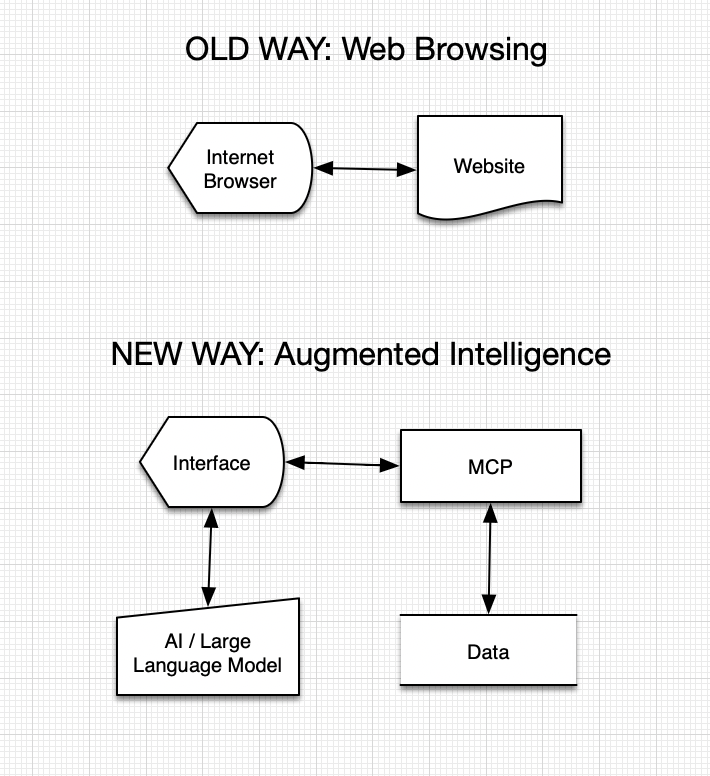

# WikiData-MCI




[](LICENSE)
[](https://github.com/aleksj/wikidata-mci/stargazers)
[](https://github.com/aleksj/wikidata-mci/issues)
[](https://github.com/aleksj/wikidata-mci/pulls)
[](https://github.com/aleksj/wikidata-mci/graphs/contributors)

## 📖 Overview

**[WikiData](wikidata.org)** is a vast knowledge base with over 100 million entities, making it an incredible resource for  exploration and querying.

**WikiData-MCI** is a new-generation AI-enhanced interface to Wikidata that offers the power of large language models, agentic technology based on MCP, and user-friendly visual interactivity.

**Model-Context-Interface** is the user interface developed for access to a MCP server. It performs a similar role as a web browser would in interfacing with a HTTP server.

Namely, MCP servers aren't just for agents, they're also for humans. MCIs are designed to augment human intelligence and provide a user-friendly interface for accessing MCP servers. Both agents and interfaces employ LLM technology.

## 🌟 Features

- **MCP**: Model-Context-Protocol interfaces orchestrates the connection between LLM and WikiData.
- **LLM**: Large Language Models for enhanced querying and exploration capabilities, for example enabling automatic conversion of natural language queries into SPARQL queries and summarization of the results.
- **Visualization**: The structures returned by WikiData are rendered as interactive knowledge graphs, allowing additional information to be expanded into, and providing a visual representation of the relationships between entities.
- **Interactivity**: Providing a real-time feedback loop giving insight into the working of the agentic knowledge exploration process.

## 🚀 Getting Started

### Prerequisites

List the software, libraries, and tools that need to be installed. For example:

```
- Node.js v14+
- npm or yarn
- MongoDB
```

### Installation

Step-by-step instructions on how to install and setup your project:

1. Clone the repository
   ```
   git clone https://github.com/aleksj/wikidata-mci.git
   ```

2. Navigate to the project directory
   ```
   cd wikidata-mci
   ```

3. Install dependencies
   ```
   npm install
   ```

4. Configure the application
   ```
   cp .env.example .env
   ```
   Then edit `.env` with your specific configuration.

5. Start the application
   ```
   npm start
   ```

## 💻 Usage

Provide instructions and examples for use. Include screenshots as needed.

```
# Example code or command
```

## 📚 Documentation

For more detailed documentation, please refer to the [Wiki](URL_TO_YOUR_WIKI) or [Docs](URL_TO_YOUR_DOCS).

## 🤝 Contributing

Contributions are what make the open source community such an amazing place to learn, inspire, and create. Any contributions you make are **greatly appreciated**.

1. Fork the Project
2. Create your Feature Branch (`git checkout -b feature/AmazingFeature`)
3. Commit your Changes (`git commit -m 'Add some AmazingFeature'`)
4. Push to the Branch (`git push origin feature/AmazingFeature`)
5. Open a Pull Request

## 📄 License

This project is licensed under the MIT License - see the [LICENSE](LICENSE) file for details.

## 👏 Acknowledgments

* List any collaborators, resources, or inspirations
* Anyone who helped with the project
* Inspirations

## 📞 Contact

Aleks Jakulin - [@aleksj](https://x.com/aleksj) - aleks+mci@data.flowers

Project Link: [https://github.com/aleksj/wikidata-mci](https://github.com/aleksj/wikidata-mci)
